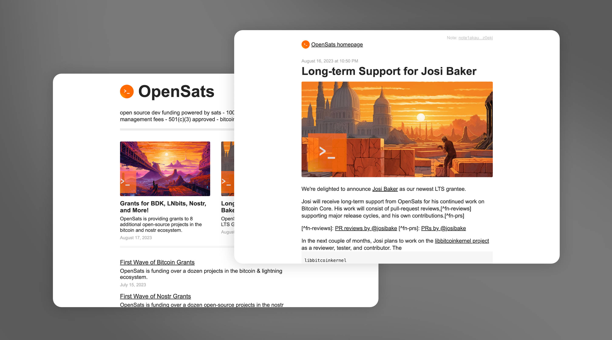

# Oracolo

Oracolo is a minimalist blog powered by [Nostr](https://njump.me), that consists of a single html file, weighing only ~140Kb.
You can use whatever Nostr client that supports long format ([habla.news](https://habla.news), [yakihonne](https://yakihonne.com), [highlighter.com](https://highlighter.com), etc) to write your posts, and your personal blog is automatically updated.  
It works also without a web server; for example you can send it via email as a business card.

## Examples
Here you can find some generated blogs for [OpenSats](https://raw.githack.com/dtonon/oracolo/master/examples/opensats.html), [Hodlbod](https://raw.githack.com/dtonon/oracolo/master/examples/hodlbod.html) and [fiatjaf](https://raw.githack.com/dtonon/oracolo/master/examples/fiatjaf.html).

## How to use - Developer mode

1) Open `index.html` and personalize the `publicKey` and `relays` meta tags
2) Run `npm install`
3) Run `npm run build`
4) Deploy the generated dist/index.html file

## How to use - "I hate npm" mode

1) Open directly `dist/index.html` and personalize the `publicKey` and `relays` meta tags
4) Save the file and deploy

## Why this ugly hash routing?

Because this way the blog has fully functioning permalinks, without needing any additional server-level configuration to capture all the urls.

## Caveats / To do

SEO is currently not existent, work in progress.  
No pagination in the home.